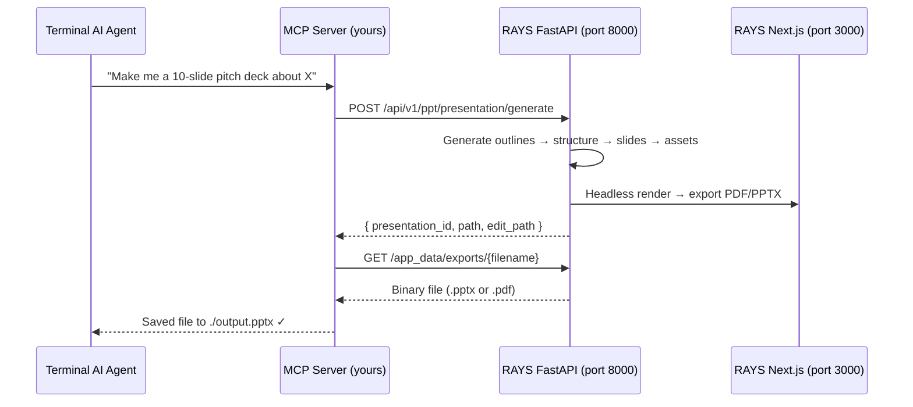
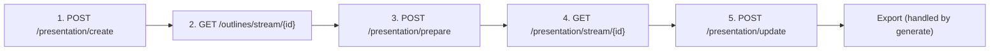

# MCP Server Wiring Guide — RAYS DeckForge

> Everything you need to wire an AI agent running in a terminal to call RAYS DeckForge and return a `.pptx` or `.pdf`.

---

## Architecture Overview



### How It Works

Your MCP server sits between your terminal agent and the running RAYS DeckForge instance. The FastAPI backend at `http://127.0.0.1:8000` does all the heavy lifting — outline generation, slide content, image generation, and export. Your MCP server just needs to:

1. Accept a prompt from the agent
2. Call the right FastAPI endpoint
3. Download the resulting file
4. Return it to the agent

---

## Prerequisites

Before your MCP server can work, the RAYS DeckForge stack must be running:

```bash
# From the RAYS_DECK root
./start-dev.sh
```

This starts:

- **FastAPI** on `http://127.0.0.1:8000`
- **Next.js** on `http://127.0.0.1:3000`
- **Built-in MCP** on `http://127.0.0.1:8001` (reference implementation)

> [!IMPORTANT]
> The user must have configured their LLM API key (e.g., OpenAI, Google, Anthropic) through the Settings UI **before** the MCP server can generate presentations. The FastAPI backend reads keys from `~/.rays_deckforge/user_config.json`.

---

## Route 1: One-Shot Generation (Recommended for MCP)

This is the simplest path — a single POST that handles everything end-to-end.

### `POST /api/v1/ppt/presentation/generate`

**URL:** `http://127.0.0.1:8000/api/v1/ppt/presentation/generate`

**Content-Type:** `application/json`

#### Request Body

```json
{
  "content": "Create a pitch deck for a SaaS startup that automates invoice processing using AI",
  "n_slides": 10,
  "language": "English",
  "template": "general",
  "export_as": "pptx",
  "tone": "default",
  "verbosity": "standard",
  "include_title_slide": true,
  "include_table_of_contents": false,
  "web_search": false,
  "instructions": null,
  "slides_markdown": null,
  "files": null,
  "trigger_webhook": false
}
```

#### Field Reference

| Field                       | Type               | Required | Default       | Description                                                                                  |
| --------------------------- | ------------------ | -------- | ------------- | -------------------------------------------------------------------------------------------- |
| `content`                   | `string`           | **Yes**  | —             | The topic/prompt for the presentation                                                        |
| `n_slides`                  | `int \| null`      | No       | `null` (auto) | Number of slides. `null` = model decides. Max: `50`                                          |
| `language`                  | `string \| null`   | No       | `null` (auto) | Language for the presentation                                                                |
| `template`                  | `string`           | No       | `"general"`   | Template name. Built-in: `general`, `modern`, `standard`, `swift`. Custom: `"custom-<uuid>"` |
| `export_as`                 | `"pptx" \| "pdf"`  | No       | `"pptx"`      | Output format                                                                                |
| `tone`                      | `string`           | No       | `"default"`   | Tone of text. Options: `default`, `formal`, `casual`, `creative`                             |
| `verbosity`                 | `string`           | No       | `"standard"`  | How verbose. Options: `concise`, `standard`, `detailed`                                      |
| `include_title_slide`       | `bool`             | No       | `true`        | Whether to include a title slide                                                             |
| `include_table_of_contents` | `bool`             | No       | `false`       | Whether to include TOC (needs ≥3 slides)                                                     |
| `web_search`                | `bool`             | No       | `false`       | Enable web grounding for content                                                             |
| `instructions`              | `string \| null`   | No       | `null`        | Extra instructions for the AI                                                                |
| `slides_markdown`           | `string[] \| null` | No       | `null`        | Pre-written slide content (bypasses outline generation)                                      |
| `files`                     | `string[] \| null` | No       | `null`        | File paths for context (uploaded via `/files/upload` first)                                  |
| `trigger_webhook`           | `bool`             | No       | `false`       | Whether to fire webhooks on completion                                                       |

#### Response (200 OK)

```json
{
  "presentation_id": "a1b2c3d4-e5f6-7890-abcd-ef1234567890",
  "path": "/app_data/exports/My_Pitch_Deck.pptx",
  "edit_path": "/presentation?id=a1b2c3d4-e5f6-7890-abcd-ef1234567890"
}
```

| Field             | Description                                                                     |
| ----------------- | ------------------------------------------------------------------------------- |
| `presentation_id` | UUID of the created presentation                                                |
| `path`            | Relative path to the exported file. Download from `http://127.0.0.1:8000{path}` |
| `edit_path`       | URL path to edit in the web UI (`http://127.0.0.1:3000{edit_path}`)             |

#### Downloading the File

```bash
# The path from the response is relative to the FastAPI server
curl -o output.pptx http://127.0.0.1:8000/app_data/exports/My_Pitch_Deck.pptx
```

> [!NOTE]
> This endpoint is **synchronous** — it blocks until the entire presentation is generated and exported. For large presentations (20+ slides), this can take 30-120 seconds.

---

## Route 2: Async Generation (For Long-Running Jobs)

If you want non-blocking generation with status polling:

### Step 1: Start Async Generation

**`POST /api/v1/ppt/presentation/generate/async`**

Same request body as the sync endpoint above.

#### Response (200 OK)

```json
{
  "id": "task-uuid-here",
  "status": "pending",
  "message": "Queued for generation",
  "data": null,
  "error": null
}
```

### Step 2: Poll for Status

**`GET /api/v1/ppt/presentation/status/{task_id}`**

#### Response — In Progress

```json
{
  "id": "task-uuid-here",
  "status": "pending",
  "message": "Generating slides",
  "data": null,
  "error": null
}
```

Status messages progress through:

1. `"Queued for generation"`
2. `"Generating presentation outlines"`
3. `"Selecting layout for each slide"`
4. `"Generating slides"`
5. `"Fetching assets for slides"`
6. `"Exporting presentation"`
7. `"Presentation generation completed"` (final)

#### Response — Completed

```json
{
  "id": "task-uuid-here",
  "status": "completed",
  "message": "Presentation generation completed",
  "data": {
    "presentation_id": "a1b2c3d4-...",
    "path": "/app_data/exports/My_Deck.pptx",
    "edit_path": "/presentation?id=a1b2c3d4-..."
  },
  "error": null
}
```

#### Response — Error

```json
{
  "id": "task-uuid-here",
  "status": "error",
  "message": "Presentation generation failed",
  "data": null,
  "error": {
    "detail": "Failed to generate presentation outlines. Please try again.",
    "status_code": 400
  }
}
```

---

## Route 3: Step-by-Step (Fine-Grained Control)

For maximum control over each phase. The UI uses this flow:



### Step 1: Create Presentation Record

**`POST /api/v1/ppt/presentation/create`**

```json
{
  "content": "AI in Healthcare",
  "n_slides": 8,
  "language": "English",
  "tone": "default",
  "verbosity": "standard",
  "instructions": null,
  "include_table_of_contents": false,
  "include_title_slide": true,
  "web_search": false,
  "file_paths": null
}
```

Returns: `PresentationModel` with `id`.

### Step 2: Stream Outlines

**`GET /api/v1/ppt/outlines/stream/{presentation_id}`**

Returns: Server-Sent Events (SSE) stream. Final event contains the complete `PresentationModel` with `outlines` populated.

### Step 3: Prepare (Assign Layouts)

**`POST /api/v1/ppt/presentation/prepare`**

```json
{
  "presentation_id": "uuid-here",
  "outlines": [...],
  "layout": { "name": "general", "slides": [...], "ordered": false },
  "title": "AI in Healthcare"
}
```

### Step 4: Stream Slides

**`GET /api/v1/ppt/presentation/stream/{presentation_id}`**

SSE stream that generates each slide's content one by one.

### Step 5: Update Theme (Optional)

**`PATCH /api/v1/ppt/presentation/update`**

```json
{
  "id": "uuid-here",
  "theme": {
    "primary": "#2563eb",
    "background": "#ffffff",
    "card": "#f8fafc",
    "stroke": "#e5e7eb",
    "primary_text": "#1e293b",
    "background_text": "#475569"
  }
}
```

---

## Supporting Endpoints

### List Available Templates

**`GET /api/v1/ppt/template-management/summary`**

Returns available custom templates with their IDs. Built-in templates don't need this — just use `"general"`, `"modern"`, `"standard"`, or `"swift"`.

```json
{
  "success": true,
  "presentations": [
    {
      "presentation_id": "custom-uuid",
      "layout_count": 12,
      "template": { "name": "My Custom Template", ... }
    }
  ],
  "total_presentations": 1,
  "total_layouts": 12
}
```

### List Custom Themes

**`GET /api/v1/ppt/themes/all`**

Returns saved custom themes for applying to presentations.

### Upload Files for Context

**`POST /api/v1/ppt/files/upload`**

Multipart form upload. Returns file paths that can be passed to `files` in the generate request.

### List All Presentations

**`GET /api/v1/ppt/presentation/all`**

Returns all generated presentations with their first slide.

### Get Single Presentation

**`GET /api/v1/ppt/presentation/{id}`**

Returns a single presentation with all slides.

### Delete Presentation

**`DELETE /api/v1/ppt/presentation/{id}`**

---

## MCP Server Architecture

### Option A: FastMCP from OpenAPI (Already Exists!)

Your repo already has `mcp_server.py` that auto-generates MCP tools from the OpenAPI spec:

```python
# servers/fastapi/mcp_server.py
mcp = FastMCP.from_openapi(
    openapi_spec=openapi_spec,  # openai_spec.json
    client=httpx.AsyncClient(base_url="http://127.0.0.1:8000"),
    name="RAYS DeckForge API",
)
```

> [!WARNING]
> The current `openai_spec.json` only exposes 2 endpoints (`/generate` and `/template-management/summary`). To expose more endpoints, update this file.

### Option B: Build Your Own MCP Server (Recommended)

For a cleaner agent experience, build a focused MCP server with curated tools:

```python
# mcp_deckforge.py
import asyncio
import httpx
from fastmcp import FastMCP

mcp = FastMCP("RAYS DeckForge")
BASE_URL = "http://127.0.0.1:8000"

@mcp.tool()
async def generate_presentation(
    topic: str,
    n_slides: int = 10,
    template: str = "general",
    export_as: str = "pptx",  # "pptx" or "pdf"
    language: str = "English",
    tone: str = "default",
    verbosity: str = "standard",
    instructions: str | None = None,
) -> dict:
    """Generate a presentation from a topic and return the file path."""
    async with httpx.AsyncClient(base_url=BASE_URL, timeout=300.0) as client:
        response = await client.post(
            "/api/v1/ppt/presentation/generate",
            json={
                "content": topic,
                "n_slides": n_slides,
                "template": template,
                "export_as": export_as,
                "language": language,
                "tone": tone,
                "verbosity": verbosity,
                "instructions": instructions,
            },
        )
        response.raise_for_status()
        data = response.json()

        # Download the exported file
        file_url = data["path"]
        file_response = await client.get(file_url)
        filename = file_url.split("/")[-1]
        with open(filename, "wb") as f:
            f.write(file_response.content)

        return {
            "presentation_id": data["presentation_id"],
            "file": filename,
            "edit_url": f"http://127.0.0.1:3000{data['edit_path']}",
        }


@mcp.tool()
async def list_templates() -> list[dict]:
    """List all available templates for presentation generation."""
    builtin = [
        {"name": "general", "type": "builtin"},
        {"name": "modern", "type": "builtin"},
        {"name": "standard", "type": "builtin"},
        {"name": "swift", "type": "builtin"},
    ]
    async with httpx.AsyncClient(base_url=BASE_URL, timeout=30.0) as client:
        response = await client.get("/api/v1/ppt/template-management/summary")
        if response.status_code == 200:
            data = response.json()
            for p in data.get("presentations", []):
                template_meta = p.get("template") or {}
                builtin.append({
                    "name": f"custom-{p['presentation_id']}",
                    "display_name": template_meta.get("name", "Custom"),
                    "type": "custom",
                    "layouts": p["layout_count"],
                })
    return builtin


@mcp.tool()
async def list_presentations() -> list[dict]:
    """List all previously generated presentations."""
    async with httpx.AsyncClient(base_url=BASE_URL, timeout=30.0) as client:
        response = await client.get("/api/v1/ppt/presentation/all")
        response.raise_for_status()
        presentations = response.json()
        return [
            {
                "id": p["id"],
                "title": p.get("title", "Untitled"),
                "n_slides": p.get("n_slides"),
                "created_at": p.get("created_at"),
            }
            for p in presentations
        ]


if __name__ == "__main__":
    mcp.run(transport="stdio")  # For terminal agent integration
```

### How to Wire to Your Terminal Agent

#### Stdio Transport (Claude Desktop, Cursor, etc.)

```json
{
  "mcpServers": {
    "deckforge": {
      "command": "python",
      "args": ["mcp_deckforge.py"],
      "cwd": "/path/to/your/mcp/server"
    }
  }
}
```

#### HTTP Transport (Any Agent)

```python
# Start with HTTP transport instead
mcp.run(transport="http", host="127.0.0.1", port=8001)
```

Then connect from your agent:

```
MCP endpoint: http://127.0.0.1:8001/mcp
```

---

## Complete Call Flow — From Prompt to File

Here's the exact sequence your MCP tool should execute for the simplest path:

```
1. Agent sends: "Make me a 10-slide pitch deck about AI in education"
                              │
2. MCP tool calls:            │
   POST http://127.0.0.1:8000/api/v1/ppt/presentation/generate
   Body: {
     "content": "AI in education",
     "n_slides": 10,
     "template": "general",
     "export_as": "pptx"
   }
                              │
   ⏳ Waits 30-120 seconds... │
                              │
3. Response:                  │
   {
     "presentation_id": "abc-123",
     "path": "/app_data/exports/AI_in_Education.pptx",
     "edit_path": "/presentation?id=abc-123"
   }
                              │
4. Download file:             │
   GET http://127.0.0.1:8000/app_data/exports/AI_in_Education.pptx
   → Save to ./AI_in_Education.pptx
                              │
5. Return to agent:           │
   ✓ Saved AI_in_Education.pptx (10 slides)
   Edit in browser: http://127.0.0.1:3000/presentation?id=abc-123
```

---

## Error Handling

| HTTP Code | Meaning                                               | What to Do                        |
| --------- | ----------------------------------------------------- | --------------------------------- |
| `400`     | Invalid request (bad template, too many slides, etc.) | Fix the request parameters        |
| `404`     | Presentation/template not found                       | Check the ID                      |
| `422`     | Validation error                                      | Check required fields             |
| `500`     | Generation failed (LLM error, export error)           | Retry or check LLM API key config |

> [!TIP]
> Set `httpx.AsyncClient(timeout=300.0)` — presentation generation can take 2+ minutes for large decks. The default 5s timeout will fail.

---

## Quick Reference — Minimal Working Example

```python
import httpx

BASE = "http://127.0.0.1:8000"

# Generate
r = httpx.post(f"{BASE}/api/v1/ppt/presentation/generate", json={
    "content": "Quantum Computing Basics",
    "n_slides": 8,
    "export_as": "pptx",
}, timeout=300)

data = r.json()
print(f"Created: {data['presentation_id']}")

# Download
file_r = httpx.get(f"{BASE}{data['path']}")
with open("output.pptx", "wb") as f:
    f.write(file_r.content)

print("✓ Saved output.pptx")
```
